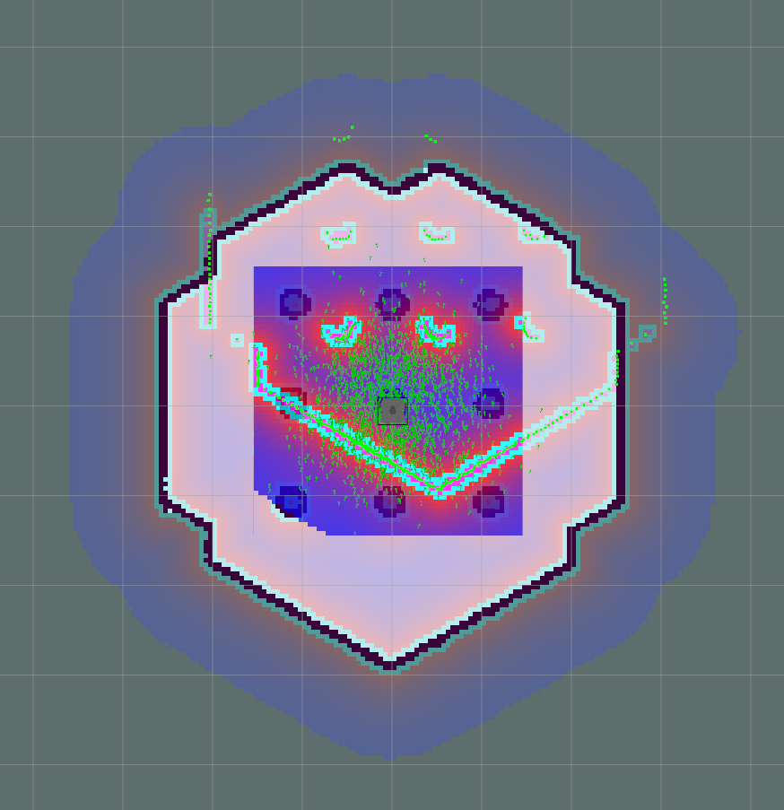

# RRT* implementation on turtlebot3

RRT* is implemented in Matlab and with ROS + turtlebot simulation

Project 5 is done in ROS and Gazebo with C++

 * Turtlebot 3 was used.
 * The world is first converted to 2D map with SLAM.
 * The radius of the robot is traced around the obstacle to plan for a point robot. (Matlab was used).
 * The main code plans the path and publishes positions to the amcl local planner

# Installation

1. Running code Requires OpenCV installation:

 https://docs.opencv.org/3.4.0/d7/d9f/tutorial_linux_install.html

```
 sudo apt-get install build-essential
 sudo apt-get install cmake git libgtk2.0-dev pkg-config libavcodec-dev libavformat-dev libswscale-dev
 sudo apt-get install python-dev python-numpy libtbb2 libtbb-dev libjpeg-dev libpng-dev libtiff-dev libjasper-dev libdc1394-22-dev
```
 2. Install matplotlib for python for the plot to work.

# To run the code

## RRT* ON MATLAB

 * Run main.m file in RRT* on MATLAB code folder.

## RRT* ON Turtlebot3 

1. Install dependent ros packages for turtle bot
    http://emanual.robotis.com/docs/en/platform/turtlebot3/pc_setup/#install-dependent-ros-packages

2. Follow this link on guide to SLAM the workspace first:

    http://emanual.robotis.com/docs/en/platform/turtlebot3/slam/

3. Create a costmap and name it point_map.png file

4. Load model variable
```
export TURTLEBOT3_MODEL=waffle
```

5. Launch simulation or the robot. To run with simulation,
```
$ roslaunch turtlebot3_gazebo turtlebot3_world.launch x_pos:=-2 y_pos:=0.5
```

To run with turtlebot3 bringup the robot.

6. Start navigation package
```
$ roslaunch turtlebot3_navigation turtlebot3_navigation.launch map_file:=/location_of_project/maps/map.yaml
```

You should see the robot sensor data miss aligned with the actual map like below.


7. Indicate Location of robot on map with 2D pose estimate in Rviz.

8. Run the planner after setting the start and end point in the code and catkin_make.
```
$ rosrun rrt_star_path_planning_turtlebot rrt_demo map_file:=/location_of_project/maps/point_map
```